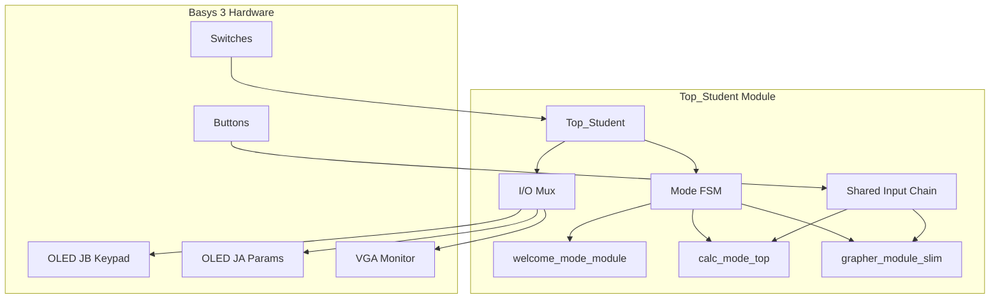
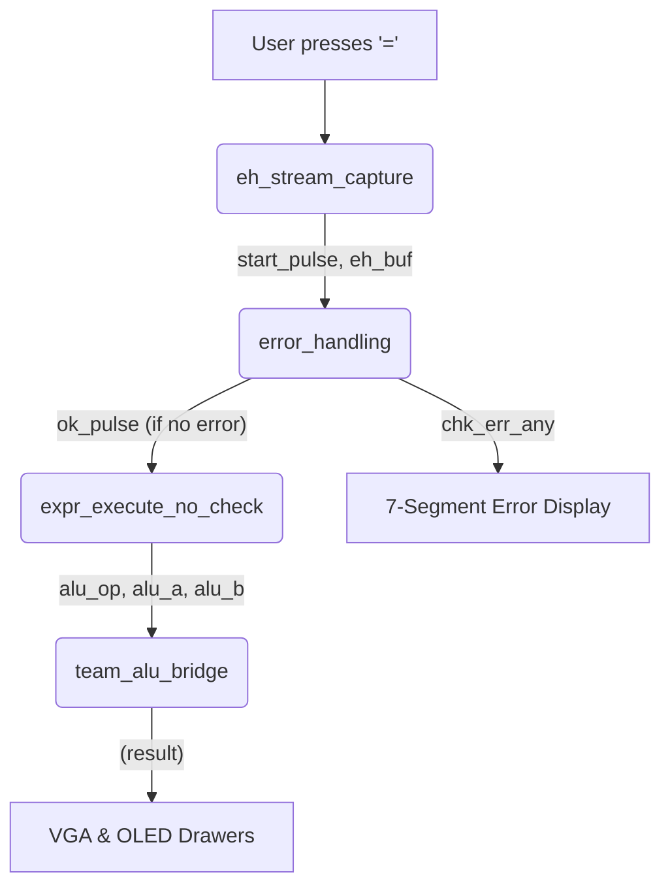

# EE2026 FPGA Calculator & Grapher

This repository contains the Verilog source code for a multifunction FPGA-based calculator system designed for the Basys 3 board. The project is separated into two primary applications due to the LUT (Look-Up Table) budget constraints of the Artix-7 FPGA:

1.  **Forryan Project (`Top_Student.v`):** The main user-facing application. This project includes a welcome screen, a full scientific calculator, and a 2D function grapher.
2.  **Polynomial Project (`poly_mode_module.v`):** A dedicated, high-precision application for finding the real and complex roots of cubic polynomials using the Newton-Raphson method.

## Forryan Project (Main Calculator & Grapher)

This is the main application, managed by `Top_Student.v`. It integrates the welcome screen, calculator mode, and grapher mode, multiplexing I/O between them.



### `Top_Student.v` - Main Controller

  * **Purpose:** The top-level module for the main application. It manages the overall system state and routes data to the correct modules and peripherals.
  * **Logic:**
      * [cite\_start]**Mode FSM:** A state machine switches `current_main_mode` based on user input[cite: 1482].
          * [cite\_start]`MODE_OFF`: `sw[15]` is low (system is in reset)[cite: 1479].
          * `MODE_WELCOME`: The initial state. [cite\_start]It waits for a mode selection [cite: 1481, 1540-1541].
          * [cite\_start]`MODE_CALCULATOR`: Activated from the welcome screen[cite: 1481].
          * [cite\_start]`MODE_GRAPHER`: Activated from the welcome screen[cite: 1482].
      * [cite\_start]**Mode Handshake:** Transitions from `MODE_WELCOME` are handled by a handshake (`mode_req`, `mode_target`, `mode_ack`) initiated by the `welcome_mode_module` [cite: 1506, 1523, 1542-1543].
      * **I/O Multiplexing:** `Top_Student` multiplexes the outputs for the two OLEDs (JA and JB) and the VGA screen. [cite\_start]For example, the `jb_oled_data` wire is fed by `shared_keypad_oled` when in calculator or grapher mode [cite: 1485, 1489-1490][cite\_start], and the `ja_oled_data` wire is fed by `grapher_screen_oled` or `calculator_screen_oled_ja` depending on the mode [cite: 1491-1494].
      * [cite\_start]**Display Drivers:** It instantiates three `display_handler` modules: one for the JB OLED (keypad), one for the JA OLED (parameters), and one for the VGA display [cite: 1501-1505].

-----

### Shared Input System (Input Chain)

This is a pipelined chain of modules that captures physical button presses from the `oled_keypad` and delivers a standardized ASCII stream to the active application mode.

```mermaid
graph TD
    A[btn_debounced] --> B(oled_keypad)
    B -- key_code, key_valid --> C(key_to_ascii_convertor)
    C -- ascii_char, is_multichar, multichar_data --> D(shared_equation_buffer)
    D -- shared_buffer, shared_length --> E[App Modules (Calc/Graph)]
```

1.  [cite\_start]**`debouncer.v`:** Takes the raw `btn` inputs and produces a stable, one-pulse-per-press `btn_debounced` signal to prevent multiple inputs [cite: 612-623, 1508].
2.  **`oled_keypad.v`:** This module serves two functions:
      * [cite\_start]**Display:** Renders the multi-page (Numbers, Functions, Variables) keypad on the JB OLED display[cite: 1322, 1331]. [cite\_start]It also renders the current equation from the `shared_buffer`, auto-scrolling if the length exceeds 10 characters [cite: 1366-1368, 1374, 1377-1399].
      * [cite\_start]**Input:** Watches `btn_debounced` for navigation (Up, Down, Left, Right) [cite: 1343-1354] and selection (Center). [cite\_start]When a key is selected, it generates a `key_valid` pulse and the corresponding `key_code` (e.g., `KEY_SIN`, `KEY_5`) [cite: 1328, 1355-1365].
3.  [cite\_start]**`key_to_ascii_convertor.v`:** Translates the `key_code` into a standard `ascii_char` [cite: 1034-1057].
      * [cite\_start]**Multi-Char Logic:** For function keys like `KEY_SIN`, it asserts `is_multichar`, sets `char_count` to 3, and places the full string ("nis") onto the `multichar_data` bus [cite: 1032, 1060-1061].
4.  **`shared_equation_buffer.v`:** The final module in the chain. [cite\_start]It listens for `ascii_valid`[cite: 941, 949].
      * [cite\_start]**Single Char:** If `is_multichar` is false, it appends the single `ascii_char` to the `shared_equation_buffer` [cite: 959, 981-983].
      * [cite\_start]**Multi Char:** If `is_multichar` is true, an internal FSM (`STATE_WRITE_1`, `STATE_WRITE_2`, etc.) writes each character from `multichar_data` to the buffer sequentially over multiple clock cycles [cite: 942, 978-981, 983-992].
      * **Control:** It also handles control characters directly, such as 'C' (`is_clear_reg`) to reset the buffer length to 0 and 'D' (`is_delete_reg`). [cite\_start]The delete logic is "smart," detecting function words like "sin" or "ln" and deleting the entire block instead of one character [cite: 951-952, 964-967, 992-1002].

-----

### Calculator Mode (`calc_mode_top.v`)

  * **Purpose:** A complete scientific calculator that parses and evaluates infix expressions.
  * **Execution Chain:** This mode uses a pipelined execution flow to check, parse, and solve the expression.

<!-- end list -->



1.  [cite\_start]**`eh_stream_capture.v`:** When the calculator is active, this module independently captures `ascii_char` inputs into a local 32-byte buffer (`eh_buf`)[cite: 1637]. [cite\_start]When it sees the '=' character (`8'h3D`), it stops capturing and emits a one-cycle `start_pulse`[cite: 1016, 1636].
2.  [cite\_start]**`error_handling.v`:** This `start_pulse` triggers the error checker[cite: 1638]. [cite\_start]It's a complex FSM that scans the `eh_buf` [cite: 1079, 1148-1157] for syntax errors.
      * [cite\_start]It checks for empty input (`E_EMPTY`) [cite: 1076, 1149][cite\_start], mismatched parentheses (`E_PAREN`) [cite: 1076, 1153][cite\_start], invalid operator sequences like "5 \* + 3" (`E_SEQ`) [cite: 1076, 1151][cite\_start], invalid number formats (`E_NUMFMT`) [cite: 1077, 1162][cite\_start], and number range overflows (`E_RANGE_IN`)[cite: 1077, 1212].
      * It also features a dedicated "RHS Division-by-Zero Scanner" that activates when a '/' is seen. [cite\_start]It scans ahead to see if the *literal* number on the right-hand side is zero (e.g., "5 / 0.0") and flags `E_DIV0` [cite: 1077, 1084, 1119-1136].
3.  [cite\_start]**`expr_execute_no_check.v`:** If the `error_handling` module finishes (`chk_done`) with no errors (`~chk_err_any`), an `ok_pulse` is generated[cite: 1642]. [cite\_start]This pulse starts the main expression evaluator[cite: 1645]. [cite\_start]This module uses a `precedence_eval` unit to convert the infix expression to postfix and sends operations (opcode, operands) to the ALU bridge[cite: 2486].
4.  **`team_alu_bridge.v`:** This is the core ALU. [cite\_start]It's an FSM that manages various multi-cycle arithmetic units[cite: 1814]. [cite\_start]It receives an `alu_op` and routes the request[cite: 1782].
      * [cite\_start]`OP_ADD`/`OP_SUB` are combinational [cite: 1784, 1788-1790, 1825, 1836].
      * [cite\_start]`OP_MUL`, `OP_DIV`, `OP_POW`, `OP_LOG2`, `OP_SIN`, `OP_COS`, `OP_TAN` trigger their respective hardware modules (`multiply_module`, `divider_module`, etc.) [cite: 1784, 1791-1800, 1826-1830].
      * [cite\_start]`OP_LN` is a special two-step operation: it first computes `log2(x)` using `u_log`, then multiplies that result by a Q16.8 constant for $\ln(2)$ (`Q168_LN2`) using `u_mul` [cite: 1784, 1786, 1816, 1828, 1831-1835].

<!-- end list -->

  * **Display Logic:**
      * **VGA (`calculator_mode_output_drawer.v`):** This module renders the main UI on the VGA screen. [cite\_start]It draws an "Input Box" to display the `shared_buffer` (what the user is typing) [cite: 1985, 1993-1995, 2001-2006] [cite\_start]and an "Answer Box" to display the final `exec_result` [cite: 1986, 1998-2000]. [cite\_start]It contains a large block of logic to convert the 25-bit signed Q16.8 `number_input` into a decimal ASCII string, handling sign, integer, and fractional parts (up to 2 decimal places) [cite: 2059-2129].
      * **7-Segment (`sevenseg_driver.v`):** This is used exclusively for error reporting in this mode. [cite\_start]`calc_mode_top` maps the `eh_err_code_l` to 4-character error messages (e.g., `E_PAREN` becomes "EPAR", `E_DIV0` becomes "EZER") [cite: 1661-1662, 1667-1674] [cite\_start]and displays them on the 7-segment display [cite: 1693-1694].

-----

### Grapher Mode (`grapher_module_slim.v`)

  * **Purpose:** To parse, store, and render up to two mathematical functions simultaneously on the VGA display.
  * [cite\_start]**Sub-Modes:** This module has two distinct operating modes based on `sw[3]`[cite: 1703]:
    1.  [cite\_start]**Equation Mode (`sw[3] = 0`):** The shared input chain is active[cite: 1703, 1712]. The user types a full equation (e.g., "y=3x^2-x+4").
    2.  [cite\_start]**Manual Mode (`sw[3] = 1`):** The `graph_select_screen` is displayed on the VGA [cite: 1703, 1708-1710]. The user first selects a function type (e.g., "Linear", "Quadratic"), and then uses the keypad to enter numerical coefficients for that function.

<!-- end list -->

```mermaid
graph TD
    A[Grapher Mode Active] --> B{sw[3] state?}
    B -- 0 (Equation) --> C[equation_parser]
    B -- 1 (Manual) --> D[graph_select_screen]
    D --> E[number_parser & parameter_input]
    C --> F[graph_renderer]
    E --> F
    F --> G[VGA Display]
```

  * **Parsing Logic:**
      * [cite\_start]**`equation_parser.v`:** Active only in Equation Mode[cite: 1712]. [cite\_start]It activates on the `shared_equation_complete` signal[cite: 1712, 2677]. [cite\_start]This is a large FSM that moves through states like `STATE_CHECK_FUNCTION`, `STATE_PARSE_SIGN`, `STATE_PARSE_COEFF`, `STATE_PARSE_X`, and `STATE_CHECK_POWER` [cite: 2666-2668]. [cite\_start]It parses the string and accumulates coefficients into an array (`coeff[0:3]`) based on the power of 'x' it finds (e.g., `coeff[3]` for $x^3$, `coeff[1]` for $x$, `coeff[0]` for the constant) [cite: 2670, 2764-2765]. [cite\_start]It also identifies function names like "sin", "cos", "exp" [cite: 2688-2715]. [cite\_start]It outputs the final 9-bit signed coefficients [cite: 2661, 2770-2780].
      * [cite\_start]**`number_parser.v`:** Active only in Manual Mode[cite: 2159]. [cite\_start]It parses a single number (e.g., "-12") entered by the user, respecting `sw[3]` for signed/unsigned mode [cite: 2159, 2167, 2183-2193]. [cite\_start]It outputs a 9-bit signed number[cite: 2159].
      * [cite\_start]**`parameter_input.v`:** Manages the state for Manual Mode, tracking which parameter (e.g., 'A', 'B', 'C') is currently being edited[cite: 1739].
  * **Rendering Logic:**
      * **`graph_renderer.v`:** This is the main rendering engine. [cite\_start]It takes the coefficients for two function "slots" (from either the parser or manual entry)[cite: 1, 1767].
      * [cite\_start]It instantiates a separate drawing module for each function type: `cubic_graph` (which is a general-purpose $ax^3+bx^2+cx+d$ engine, also used for linear and quadratic), `sincos_graph`, `tan_graph`, `exp_graph`, and `ln_graph` [cite: 32-38].
      * [cite\_start]Each of these engines is a deeply pipelined FSM (e.g., `cubic_graph` uses 6 stages [cite: 115-148]) that calculates the expected `y` value for every `x` pixel coordinate from the `vga_sync` module.
      * [cite\_start]The `sincos_graph`, `tan_graph`, `exp_graph`, and `ln_graph` modules use Block RAM ROMs (`sin_table_ver_two.mem`, `tan_table_ver_two.mem`, `exp_table.mem`, `ln_table.mem`) to store pre-calculated lookup tables for high-speed evaluation [cite: 163-164, 210-211, 251-252, 298-299].
      * [cite\_start]`graph_renderer` also contains a 7-stage pipeline and FSM to detect and find the coordinates of intersections between the two functions or the axes [cite: 51, 56-59, 61-71, 79-105].
  * **Display Logic:**
      * **`grapher_screen_oled.v`:** Displays contextual information on the second (JA) OLED. [cite\_start]In Manual Mode, it shows the parameters being entered (e.g., "A: [ 12]", "B: [ -5]") [cite: 379-390]. [cite\_start]It also has a special screen (`show_intersect_screen`) that displays the (X, Y) coordinates of a found intersection, converting the pixel values back into mathematical grid units [cite: 357, 475-505].

-----

## Polynomial Project (Root Finder)

This is a separate, high-precision application dedicated to solving cubic polynomial equations. It does not run concurrently with the Forryan project. It is managed by `poly_mode_module.v` and uses `poly_solver.v` as its computational core.

### `poly_mode_module.v` - UI & Coefficient Entry

  * **Purpose:** Provides the top-level control and user interface for the polynomial solver.
  * **Logic:**
      * **Coefficient Entry:** Manages the entry of the four cubic coefficients (A, B, C, D). [cite\_start]It uses `active_coeff_index` to track which coefficient is being edited[cite: 1221].
      * [cite\_start]**Input Validation:** It listens for keyboard strobes (`poly_key_strobe`) and implements "smart input validation" to enforce a specific numerical format (e.g., max 2 integer digits, max 3 fractional digits, minus sign only at start) [cite: 1216, 1226-1229, 1304-1315].
      * [cite\_start]**Parsing:** When '=' is pressed (`ASCII_EQUALS`), it advances to the next coefficient [cite: 1297-1303]. [cite\_start]For each coefficient, it calls the `parse_coefficient` function [cite: 1297-1299]. [cite\_start]This function reads the input string (e.g., "-1.25"), manually builds the integer and fractional parts, and converts them into a 24-bit **Q18.6 fixed-point format** [cite: 1241-1272]. [cite\_start]For example, the integer part is shifted (`int_val << 6`) and added to the scaled fractional part [cite: 1271-1272].
      * [cite\_start]**Solver Trigger:** After the final coefficient ('D') is entered and parsed, it asserts the `solve_trigger` signal for one cycle to start the `poly_solver` [cite: 1302-1303].
  * [cite\_start]**Display:** It instantiates `poly_drawer_vga` to render the UI, which shows the four coefficient input boxes and, once `solve_done` is high, displays the three calculated roots [cite: 1316-1318].

### `poly_solver.v` - Newton-Raphson FSM

  * **Purpose:** This is the core solver. It's a large, pipelined Finite State Machine that finds the three roots of the cubic equation $ax^3+bx^2+cx+d=0$ provided by `poly_mode_module`.
  * [cite\_start]**Internal Format:** The solver immediately converts the incoming 24-bit Q18.6 coefficients into a higher-precision internal 32-bit **Q22.14 format** (`SHIFT_IO_TO_INT`) to maintain precision during calculations [cite: 2502-2503].

<!-- end list -->

```mermaid
graph TD
    IDLE -->|start| NORMALIZE[NORMALIZE: Scale Coeffs]
    NORMALIZE --> NR_INIT[NR_INIT: Select 1st Guess]
    NR_INIT --> NR_LOOP[NR_LOOP: p(x), p'(x)]
    NR_LOOP --> NR_DIV{p(x)/p'(x)}
    NR_DIV --> NR_UPDATE[NR_UPDATE: x = x - (p/p')]
    NR_UPDATE --> NR_LOOP
    NR_LOOP -- |Converged or Timeout| --> DEFLATE[DEFLATE: (Cubic) / (x-r1)]
    NR_LOOP -- |Hard Timeout| --> ERROR
    DEFLATE --> QUAD_SOLVE[QUAD_SOLVE: Find r2, r3]
    QUAD_SOLVE --> OUTPUT[OUTPUT: Display Roots]
    OUTPUT --> IDLE
```

  * **Algorithm & FSM Logic:**
    1.  [cite\_start]**`NORMALIZE`:** The FSM starts here[cite: 2554]. [cite\_start]It normalizes the Q22.14 coefficients by right-shifting them (`>>> calc_norm_shift`) based on the magnitude of coefficient 'a' to prevent overflows during multiplication [cite: 2531-2534, 2558-2561].
    2.  [cite\_start]**`NR_INIT`:** It selects an initial guess `x` for the first root[cite: 2568]. [cite\_start]The guess is chosen based on coefficient properties (e.g., if coefficients are balanced, $x = -b/2$) [cite: 2569-2573]. It resets the `iter_count`.
    3.  [cite\_start]**Newton-Raphson Loop (`NR_X2_CALC`...`NR_UPDATE`) [cite: 2576-2605]:** This is the main iterative loop to find one real root.
          * [cite\_start]**`NR_FX_...` states:** Calculates $p(x) = ax^3 + bx^2 + cx + d$ using pipelined multipliers [cite: 2583-2589].
          * [cite\_start]**`NR_FPX_...` states:** Calculates the derivative $p'(x) = 3ax^2 + 2bx + c$ [cite: 2589-2595].
          * **`NR_DIV_REQ`:** Checks for convergence. [cite\_start]If $|p(x)|$ is near zero or `iter_count` \> `MAX_ITER`, the loop terminates [cite: 2596-2599]. Otherwise, it requests a division: $p(x) / p'(x)$.
          * [cite\_start]**`NR_DIV_WAIT`:** Waits for the `divider_generator_0_inst` (a Xilinx IP core) to complete [cite: 2509, 2517, 2600-2602].
          * [cite\_start]**`NR_UPDATE`:** Calculates the new guess $x_{n+1} = x_n - (p(x) / p'(x))$ and loops back to `NR_X2_CALC` [cite: 2603-2605].
    4.  [cite\_start]**`DEFLATE_...` States [cite: 2605-2623]:** Once one real root (`x`) is found, the FSM performs synthetic division to deflate the polynomial, i.e., $(ax^3+...d) / (x - \text{root})$. This results in a new quadratic polynomial $a_2x^2 + b_2x + c_2$. [cite\_start]The new coefficients `a2`, `b2`, and `c2` are stored[cite: 2617, 2622].
    5.  [cite\_start]**`QUAD_...` States (Quadratic Solver) [cite: 2626-2656]:** The FSM now solves the remaining quadratic.
          * [cite\_start]**`QUAD_INIT_...`:** Calculates the discriminant $D = b_2^2 - 4a_2c_2$ [cite: 2626-2632].
          * [cite\_start]**`QUAD_SQRT_START`/`WAIT`:** If $D$ is non-zero, it calls the `sqrt_iterative` module to calculate $\sqrt{|D|}$ [cite: 2632-2636].
          * [cite\_start]**`QUAD_DIV1_...`/`DIV2_...`:** It performs two more divisions to calculate $(-b_2 \pm \sqrt{D}) / 2a_2$ [cite: 2640-2650].
          * [cite\_start]**`QUAD_SOLVE`:** If $D \ge 0$, the two roots are real [cite: 2651-2652]. [cite\_start]If $D < 0$, the roots are complex: $\text{real\_part} = -b_2 / 2a_2$ and $\text{imag\_part} = \pm \sqrt{-D} / 2a_2$ [cite: 2653-2655].
    6.  [cite\_start]**`OUTPUT`:** The three roots (one from NR, two from quadratic) are converted back from Q22.14 to Q18.6 (`>>> SHIFT_INT_TO_IO`) [cite: 2503, 2625, 2651-2655] [cite\_start]and `done` is asserted[cite: 2656].

### `sqrt_iterative.v` (Babylonian Method)

  * **Purpose:** A helper module for `poly_solver` that calculates the square root of a 32-bit Q22.14 number.
  * **Algorithm:** Implements the Babylonian method, which is an iterative algorithm where $x_{n+1} = (x_n + S / x_n) / 2$.
  * **Logic:**
    1.  [cite\_start]**`IDLE`:** Waits for a `start` pulse [cite: 1959-1965].
    2.  [cite\_start]**`INIT`:** On `start`, it saves `input_val` and sets the initial guess `x` to `input_val >> 1`[cite: 1961, 1963]. [cite\_start]It then asserts `div_req` to ask the `poly_solver`'s divider to calculate $S / x$ (`input_saved` / `x`)[cite: 1967].
    3.  [cite\_start]**`DIV_WAIT`:** Waits for `div_done` from the arbiter [cite: 1968-1972].
    4.  [cite\_start]**`CHECK`:** When the division is done, it gets the `div_quotient` and calculates the new guess: $x_{\text{new}} = (x + \text{div\_quotient}) >> 1$ [cite: 1970-1971]. [cite\_start]It calculates the difference `diff` between $x$ and $x_{\text{new}}$[cite: 1972].
    5.  [cite\_start]If `diff` is small enough (or `iter` \> `MAX_SQRT_ITER`), it asserts `done` and outputs `x_new` [cite: 1954, 1973-1975]. [cite\_start]Otherwise, it sets $x = x_{\text{new}}$ and loops back to `INIT` for another iteration[cite: 1976].