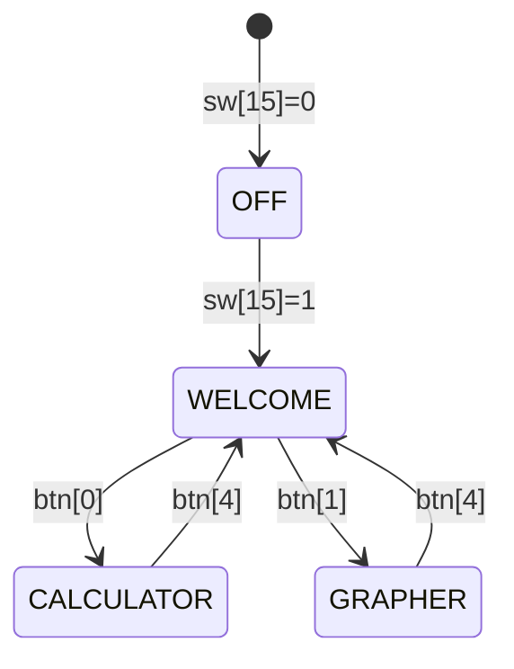

# EE2026-Project-Vivado

This repository contains two separate Vivado projects for the EE2026 FPGA-based calculator system. The projects are split because the Basys 3 FPGA's LUT budget (approximately 20,800 LUTs) is insufficient to accommodate both the main calculator functionality and the polynomial solving algorithms in a single design. The polynomial solver alone consumes significant LUT resources due to its complex FSM and fixed-point arithmetic operations.

1. **Forryan Project** (`forryannyy/`): The main calculator application with multiple modes (welcome, calculator, grapher).
2. **Polynomial Project** (`project_gner/`): A dedicated project for polynomial root finding using Newton-Raphson method with fixed-point arithmetic.

## Table of Contents
- [Forryan Project](#forryan-project)
  - [Features](#features)
  - [Architecture](#architecture)
  - [Calculator Algorithm](#calculator-algorithm)
  - [Graphing Algorithm](#graphing-algorithm)
  - [Input/Output Systems](#inputoutput-systems)
  - [Key Components](#key-components)
  - [Mode Flow](#mode-flow)
- [Polynomial Project](#polynomial-project)
- [Algorithm Implementation](#algorithm-implementation)
- [Getting Started](#getting-started)
- [Project Structure](#project-structure)
- [Dependencies](#dependencies)

---

## Forryan Project

The main calculator application built for the Basys 3 FPGA board (Artix-7 XC7A35T). This project implements core calculator functionality with welcome, calculator, and grapher modes. **Note**: Polynomial solving functionality was separated into a dedicated project (project_gner) because integrating it would exceed the Basys 3's LUT budget of ~20,800 LUTs.

### Features
- **Multi-Mode Operation**: Welcome screen, calculator, and grapher modes
- **Input Methods**: Button controls and PS/2 keyboard support
- **Display**: Dual OLED displays for keypad/parameters and VGA for graphical output
- **Calculator**: Expression evaluation with arithmetic, trigonometric, and power functions
- **Grapher**: Multi-function plotting supporting linear, quadratic, cubic, and transcendental functions

### Architecture

```mermaid
graph TD
    A[Top_Student Module] --> B[Mode Controller]
    B --> C[Welcome Mode]
    B --> D[Calculator Mode]
    B --> E[Grapher Mode]

    D --> F[Expression Parser]
    F --> G[Precedence Evaluator]
    G --> H[ALU Bridge]
    H --> I[Arithmetic Modules]
    H --> J[Trigonometric Modules]

    E --> K[Function Renderer]
    K --> L[Pixel Evaluator]
    L --> M[Multi-Function Plotter]

    A --> N[VGA Multiplexer]
    A --> O[OLED Multiplexer]
    A --> P[PS/2 Keyboard Interface]
    A --> Q[Button Debouncers]

### Input/Output Systems

**Dual Display Architecture**:
- **OLED Displays**: 128x64 pixel monochrome displays for keypad input and parameter display
- **VGA Output**: 640x480 resolution for high-detail graphing and welcome screens
- **Display Multiplexing**: Automatic routing based on current mode

**Input Processing**:
- **PS/2 Keyboard**: Full ASCII character input with key-to-ASCII conversion
- **Button Interface**: 5 debounced buttons for mode navigation
- **Shared Equation Buffer**: 512-bit buffer for expression storage across modes

**Key Components**:
- `oled_keypad.v`: OLED display driver with keypad layout rendering
- `key_to_ascii_convertor.v`: PS/2 scan code to ASCII translation
- `debouncer.v`: Hardware debouncing for button inputs
- `vga_sync.v`: VGA timing controller for 640x480@60Hz
```

### Key Components
- **Top_Student.v**: Main top-level module handling mode switching and I/O multiplexing
- **Welcome_Module.v**: Welcome screen with mode selection
- **Calculator_Module.v**: Expression evaluation with precedence-based parsing
- **Grapher_Module.v**: Multi-function graphing with pixel-based rendering

### Calculator Algorithm

The calculator implements a complete expression evaluator supporting arithmetic and transcendental functions.

**Expression Parsing (Shunting-Yard Algorithm)**:
- Converts infix notation to postfix using operator precedence
- Supports parentheses for grouping
- Handles operator precedence: `^` (power) > `*`/`/` > `+`/`-`

**Supported Operations**:
- **Arithmetic**: Addition, subtraction, multiplication, division
- **Power Functions**: `x^y` (exponentiation)
- **Logarithmic**: `log2(x)` (base-2 logarithm)
- **Trigonometric**: `sin(x)`, `cos(x)`, `tan(x)`
- **Constants**: π (pi), e (Euler's number)

**ALU Implementation**:
- Fixed-point arithmetic (Q16.8 format: 16 integer bits, 8 fractional bits)
- Dedicated hardware modules for each operation:
  - `adder_module`: Addition/subtraction with overflow detection
  - `multiply_module`: Multiplication with pipelined execution
  - `divider_module`: Division with iterative algorithm
  - `power_module`: Exponentiation using logarithmic identities
  - `trigo_module`: Trigonometric functions using CORDIC algorithm

**Execution Flow**:
1. Parse ASCII input into tokens
2. Convert to postfix notation using precedence evaluation
3. Execute operations sequentially through ALU pipeline
4. Display result on OLED screen

### Graphing Algorithm

The grapher renders multiple mathematical functions simultaneously on VGA display with real-time pixel evaluation.

**Supported Function Types**:
- **Linear**: `y = mx + b`
- **Quadratic**: `y = ax² + bx + c`
- **Cubic**: `y = ax³ + bx² + cx + d`
- **Trigonometric**: `y = A·sin(x)`, `y = A·cos(x)`, `y = A·tan(x)`
- **Exponential**: `y = A·e^x`
- **Logarithmic**: `y = A·ln(x)`

**Rendering Algorithm**:
- **Pixel-Based Evaluation**: For each VGA pixel (640x480), evaluate all active functions
- **Coordinate Mapping**: VGA coordinates (0-639, 0-479) mapped to mathematical domain
- **Color Coding**: Automatic color assignment per function type (red=sin, blue=cos, green=linear, etc.)
- **Grid Overlay**: 16-pixel grid lines for coordinate reference
- **Intersection Detection**: Optional highlighting of function intersections

**Performance Optimizations**:
- Parallel evaluation of up to 2 functions simultaneously
- Fixed-point arithmetic (9-bit signed coefficients)
- Pipelined computation to meet VGA timing requirements (60Hz refresh)

**Input Interface**:
- Keyboard coefficient entry for each function
- Real-time parameter adjustment
- Function type selection via switches

### Mode Flow



---

## Polynomial Project

A dedicated Vivado project focused exclusively on polynomial root finding algorithms. **This project was created because the polynomial solver's FSM (finite state machine), fixed-point arithmetic operations, and IP core instantiations consume too many LUTs to fit alongside the calculator functionality in the Forryan project.**

### Purpose
This project isolates the polynomial solving components for:
- Development of Newton-Raphson root finding FSM
- Testing fixed-point arithmetic precision (Q18.6/S32.14)
- Verification against Python reference implementation
- LUT utilization analysis for resource budgeting

### Key Features
- **Newton-Raphson Method**: Iterative root finding for cubic polynomials using derivative-based refinement
- **Fixed-Point Arithmetic**: Q18.6 input/output, S32.14 internal computation
- **Hardware Acceleration**: Uses Xilinx divider and square root IP cores
- **Comprehensive Testing**: 38 test cases covering various polynomial scenarios

### Architecture

```mermaid
graph TD
    A[Poly Solver FSM] --> B[Normalization]
    B --> C[Newton-Raphson Root Finding]
    C --> D[Polynomial Evaluation p(x)]
    D --> E[Derivative p'(x)]
    E --> F[Root Update: x - p(x)/p'(x)]
    F --> G{Converged?}
    G -->|No| C
    G -->|Yes| H[Deflation]
    H --> I[Quadratic Solver]
    I --> J[Output Roots]

    D --> K[Direct Polynomial Evaluation]
    I --> L[Discriminant]
    L --> M[Square Root]
    M --> N[Babylonian Method]
```

### Test Coverage
- **38 Test Cases**: Comprehensive suite covering:
  - Simple polynomials: x²-1=0, x³-1=0
  - Complex coefficients: a₃=±1-8, a₂=±1-8, a₁=±1-8, a₀=±1-8 (Q18.6 format)
  - Edge cases: zero leading coefficients, repeated roots, near-zero discriminants
  - Numerical stability: polynomials requiring high iteration counts

### Files
- `poly_solver.v`: Main solver FSM with Newton-Raphson implementation
- `sqrt_iterative.v`: Square root using Babylonian method
- `div_iterative.v`: Division wrapper for fixed-point operations
- Testbenches: `tb_poly_solver_Q12_4.v`, `tb_poly_solver_Q18_6.v`

---

## Algorithm Implementation

### 1. Newton-Raphson Root Finding
**Purpose**: Find roots of cubic polynomials using derivative-based iterative refinement.

**Mathematical Basis**:
```
For polynomial p(x) = a₃x³ + a₂x² + a₁x + a₀
Newton-Raphson iteration: xₙ₊₁ = xₙ - p(xₙ)/p'(xₙ)
Where p'(x) = 3a₃x² + 2a₂x + a₁
```

**Implementation Details**:
- Fixed-point arithmetic: Q18.6 input coefficients, S32.14 internal computations
- Initial guesses: x₀ = 1.0, x₀ = -1.0, x₀ = 0.5 for finding multiple roots
- Convergence tolerance: ε = 2^(-14) (in S32.14 format)
- Maximum iterations: 20 per root to prevent infinite loops

### 2. Polynomial Evaluation (Direct Method)
**Purpose**: Compute p(x) and p'(x) for Newton-Raphson updates.

**Direct Evaluation for Cubic**:
```
p(x) = a₃x³ + a₂x² + a₁x + a₀
     = a₃x³ + a₂x² + a₁x + a₀  (computed directly)
```

**Derivative Calculation**:
```
p'(x) = 3a₃x² + 2a₂x + a₁
     = 3a₃x² + 2a₂x + a₁  (computed directly)
```

### 3. Root Classification and Deflation
**Strategy**: Find one real root using Newton-Raphson, then deflate the polynomial to reduce degree.

**Process**:
1. Apply Newton-Raphson with initial guess x₀ = 1.0
2. If convergence fails (|xₙ₊₁ - xₙ| > ε), try x₀ = -1.0, then x₀ = 0.5
3. Once root r found, deflate: p(x) ÷ (x - r) = q(x) where q is quadratic
4. Solve quadratic q(x) = 0 analytically for remaining roots
5. Output three real roots (complex roots discarded)

### 4. Quadratic Formula Implementation
**Standard Quadratic Solution**:
```
For ax² + bx + c = 0
Discriminant D = b² - 4ac
Roots: [-b ± √D] / 2a
```

**Fixed-Point Handling**:
- Careful calculation of discriminant
- Square root computation using Babylonian method
- Division by 2a using fixed-point scaling

### 5. Fixed-Point Division
**Method**: Scale dividend by 2^14 (fractional bits) before integer division to maintain precision.

**Formula**:
```
result_Q18.6 = (num_S32.14 << 14) / divisor_S32.14
```

**IP Usage**: Xilinx Divider Generator v5.0 (64-bit dividend, 32-bit divisor, signed operations)

### 6. Square Root Implementation
**Algorithm**: Babylonian (Hero's) method for computing √S.

**Iteration**:
```
x₀ = S >> 1  (initial guess: S divided by 2)
xₙ₊₁ = (xₙ + S/xₙ) / 2
Convergence: |xₙ₊₁ - xₙ| < 2^(-14) (ε = 16 in S32.14 format)
```

**Implementation**: Maximum 15 iterations, hardware timeout protection

---

## Getting Started

### Prerequisites
- Vivado 2018.2.2 (exact version used for development)
- Basys 3 FPGA board (Artix-7 XC7A35T, for Forryan project)

### Setup
1. Clone the repository
2. Open the desired project in Vivado:
   - Forryan: `forryannyy/forryannyy.xpr`
   - Polynomial: `project_gner/project_gner.xpr`
3. Generate bitstream and program the FPGA


---

## Project Structure
```
ee2026_Project/
├── forryannyy/              # Main calculator project (Basys 3)
│   ├── forryannyy.xpr       # Vivado 2018.2.2 project file
│   └── forryannyy.srcs/
│       └── sources_1/new/   # Verilog HDL sources (calculator, grapher, OLED/VGA)
├── project_gner/            # Polynomial solver project (Basys 3)
│   ├── project_gner.xpr     # Vivado 2018.2.2 project file
│   └── project_gner.srcs/
│       └── sources_1/imports/sources/features/polynomial/  # Newton-Raphson FSM
├── docs/                    # Documentation and specifications
├── consolidated_sources/    # Reference Verilog implementations
├── sim_*/                   # Testbench simulation projects (Q8.8, Q12.4, Q18.6)
└── *.tcl, *.bat             # TCL build scripts and Windows batch files
```

---

## Dependencies
- **Hardware**: Digilent Basys 3 (Artix-7 XC7A35T), 2x OLED displays (SSD1306), VGA monitor
- **IP Cores**:
  - Divider Generator v5.0 (64-bit dividend, 32-bit divisor, signed operations)
  - Block Memory Generator v8.4 (for font ROM and coefficient storage)
- **Software**: Vivado 2018.2.2, Python 3.8+ for verification

---

## Contributing
1. Validate changes against all 38 polynomial test cases using `poly_solver_test.py`
2. Maintain Q18.6 input/output and S32.14 internal fixed-point precision
3. Check LUT utilization doesn't exceed Basys 3 budget (~20,800 LUTs)
4. Update Mermaid diagrams for any FSM or architectural changes

## License
This project is part of EE2026 coursework.