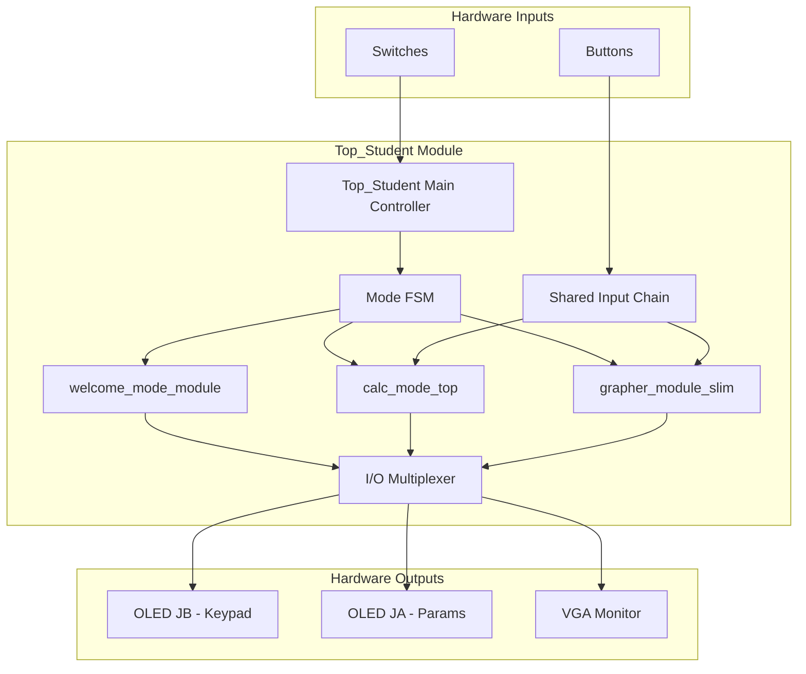
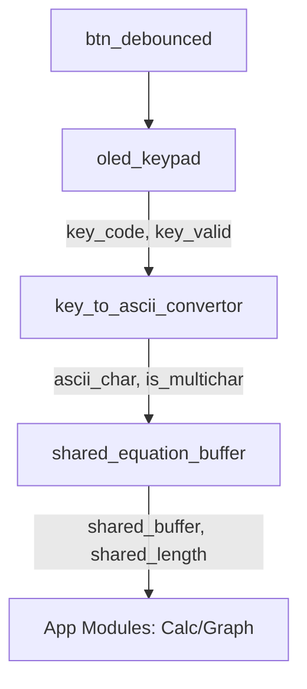
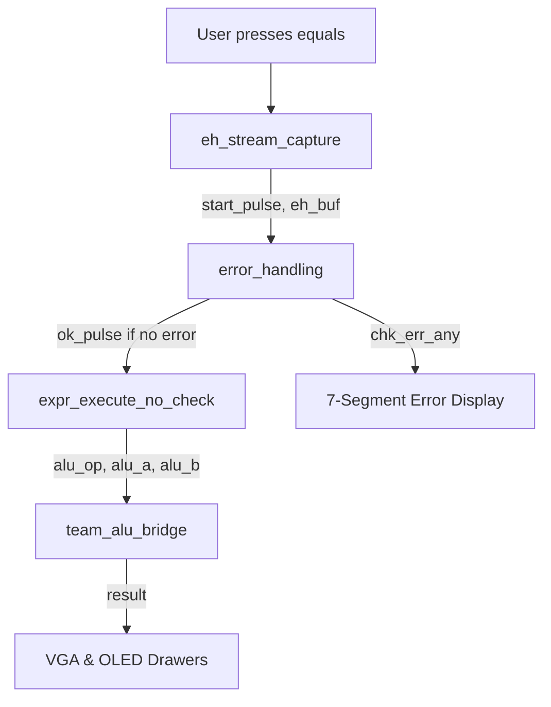
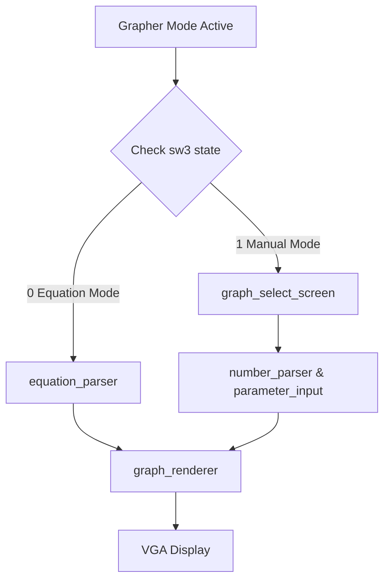
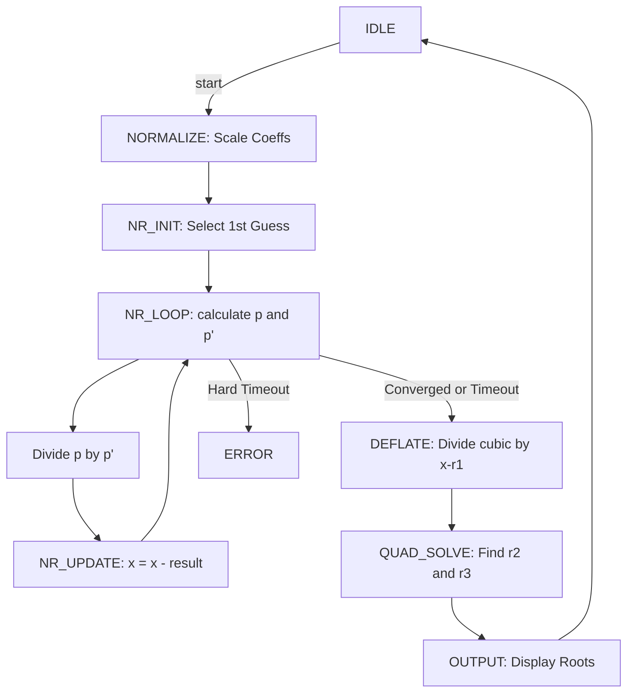

# EE2026 FPGA Calculator & Grapher

This repository contains the Verilog source code for a multifunction FPGA-based calculator system designed for the Basys 3 board. The project is separated into two primary applications due to the LUT (Look-Up Table) budget constraints of the Artix-7 FPGA:

1. **Main Project (`Top_Student.v`):** The main user-facing application. This project includes a welcome screen, a full scientific calculator, and a 2D function grapher. [forryan folder]
2. **Polynomial Project (`poly_mode_module.v`):** A dedicated, high-precision application for finding the real and complex roots of cubic polynomials using the Newton-Raphson method. [gner folder]

---

## Main Project (Main Calculator & Grapher)

This is the main application, managed by `Top_Student.v`. It integrates the welcome screen, calculator mode, and grapher mode, multiplexing I/O between them.

### `Top_Student.v` - Main Controller

**Purpose:** The top-level module for the main application. It manages the overall system state and routes data to the correct modules and peripherals.

**Logic:**
- **Mode FSM:** A state machine switches `current_main_mode` based on user input:
  - `MODE_OFF`: `sw[15]` is low (system is in reset)
  - `MODE_WELCOME`: The initial state. It waits for a mode selection
  - `MODE_CALCULATOR`: Activated from the welcome screen
  - `MODE_GRAPHER`: Activated from the welcome screen
- **Mode Handshake:** Transitions from `MODE_WELCOME` are handled by a handshake (`mode_req`, `mode_target`, `mode_ack`) initiated by the `welcome_mode_module`
- **I/O Multiplexing:** `Top_Student` multiplexes the outputs for the two OLEDs (JA and JB) and the VGA screen. For example, the `jb_oled_data` wire is fed by `shared_keypad_oled` when in calculator or grapher mode, and the `ja_oled_data` wire is fed by `grapher_screen_oled` or `calculator_screen_oled_ja` depending on the mode
- **Display Drivers:** It instantiates three `display_handler` modules: one for the JB OLED (keypad), one for the JA OLED (parameters), and one for the VGA display

---

### Shared Input System (Input Chain)

This is a pipelined chain of modules that captures physical button presses from the `oled_keypad` and delivers a standardized ASCII stream to the active application mode.

1. **`debouncer.v`:** Takes the raw `btn` inputs and produces a stable, one-pulse-per-press `btn_debounced` signal to prevent multiple inputs

2. **`oled_keypad.v`:** This module serves two functions:
   - **Display:** Renders the multi-page (Numbers, Functions, Variables) keypad on the JB OLED display. It also renders the current equation from the `shared_buffer`, auto-scrolling if the length exceeds 10 characters
   - **Input:** Watches `btn_debounced` for navigation (Up, Down, Left, Right) and selection (Center). When a key is selected, it generates a `key_valid` pulse and the corresponding `key_code` (e.g., `KEY_SIN`, `KEY_5`)

3. **`key_to_ascii_convertor.v`:** Translates the `key_code` into a standard `ascii_char`
   - **Multi-Char Logic:** For function keys like `KEY_SIN`, it asserts `is_multichar`, sets `char_count` to 3, and places the full string ("nis") onto the `multichar_data` bus

4. **`shared_equation_buffer.v`:** The final module in the chain. It listens for `ascii_valid`
   - **Single Char:** If `is_multichar` is false, it appends the single `ascii_char` to the `shared_equation_buffer`
   - **Multi Char:** If `is_multichar` is true, an internal FSM (`STATE_WRITE_1`, `STATE_WRITE_2`, etc.) writes each character from `multichar_data` to the buffer sequentially over multiple clock cycles
   - **Control:** It also handles control characters directly, such as 'C' (`is_clear_reg`) to reset the buffer length to 0 and 'D' (`is_delete_reg`). The delete logic is "smart," detecting function words like "sin" or "ln" and deleting the entire block instead of one character

---

### Calculator Mode (`calc_mode_top.v`)

**Purpose:** A complete scientific calculator that parses and evaluates infix expressions.

**Execution Chain:** This mode uses a pipelined execution flow to check, parse, and solve the expression.

1. **`eh_stream_capture.v`:** When the calculator is active, this module independently captures `ascii_char` inputs into a local 32-byte buffer (`eh_buf`). When it sees the '=' character (`8'h3D`), it stops capturing and emits a one-cycle `start_pulse`

2. **`error_handling.v`:** This `start_pulse` triggers the error checker. It's a complex FSM that scans the `eh_buf` for syntax errors:
   - Checks for empty input (`E_EMPTY`)
   - Mismatched parentheses (`E_PAREN`)
   - Invalid operator sequences like "5 * + 3" (`E_SEQ`)
   - Invalid number formats (`E_NUMFMT`)
   - Number range overflows (`E_RANGE_IN`)
   - Features a dedicated "RHS Division-by-Zero Scanner" that activates when a '/' is seen. It scans ahead to see if the *literal* number on the right-hand side is zero (e.g., "5 / 0.0") and flags `E_DIV0`

3. **`expr_execute_no_check.v`:** If the `error_handling` module finishes (`chk_done`) with no errors (`~chk_err_any`), an `ok_pulse` is generated. This pulse starts the main expression evaluator. This module uses a `precedence_eval` unit to convert the infix expression to postfix and sends operations (opcode, operands) to the ALU bridge

4. **`team_alu_bridge.v`:** This is the core ALU. It's an FSM that manages various multi-cycle arithmetic units. It receives an `alu_op` and routes the request:
   - `OP_ADD`/`OP_SUB` are combinational
   - `OP_MUL`, `OP_DIV`, `OP_POW`, `OP_LOG2`, `OP_SIN`, `OP_COS`, `OP_TAN` trigger their respective hardware modules (`multiply_module`, `divider_module`, etc.)
   - `OP_LN` is a special two-step operation: it first computes `log2(x)` using `u_log`, then multiplies that result by a Q16.8 constant for ln(2) (`Q168_LN2`) using `u_mul`

**Display Logic:**
- **VGA (`calculator_mode_output_drawer.v`):** This module renders the main UI on the VGA screen. It draws an "Input Box" to display the `shared_buffer` (what the user is typing) and an "Answer Box" to display the final `exec_result`. It contains a large block of logic to convert the 25-bit signed Q16.8 `number_input` into a decimal ASCII string, handling sign, integer, and fractional parts (up to 2 decimal places)
- **7-Segment (`sevenseg_driver.v`):** This is used exclusively for error reporting in this mode. `calc_mode_top` maps the `eh_err_code_l` to 4-character error messages (e.g., `E_PAREN` becomes "EPAR", `E_DIV0` becomes "EZER") and displays them on the 7-segment display

---

### Grapher Mode (`grapher_module_slim.v`)

**Purpose:** To parse, store, and render up to two mathematical functions simultaneously on the VGA display.

**Sub-Modes:** This module has two distinct operating modes based on `sw[3]`:

1. **Equation Mode (`sw[3] = 0`):** The shared input chain is active. The user types a full equation (e.g., "y=3x^2-x+4")
2. **Manual Mode (`sw[3] = 1`):** The `graph_select_screen` is displayed on the VGA. The user first selects a function type (e.g., "Linear", "Quadratic"), and then uses the keypad to enter numerical coefficients for that function

**Parsing Logic:**

- **`equation_parser.v`:** Active only in Equation Mode. It activates on the `shared_equation_complete` signal. This is a large FSM that moves through states like `STATE_CHECK_FUNCTION`, `STATE_PARSE_SIGN`, `STATE_PARSE_COEFF`, `STATE_PARSE_X`, and `STATE_CHECK_POWER`. It parses the string and accumulates coefficients into an array (`coeff[0:3]`) based on the power of 'x' it finds (e.g., `coeff[3]` for x³, `coeff[1]` for x, `coeff[0]` for the constant). It also identifies function names like "sin", "cos", "exp". It outputs the final 9-bit signed coefficients

- **`number_parser.v`:** Active only in Manual Mode. It parses a single number (e.g., "-12") entered by the user, respecting `sw[3]` for signed/unsigned mode. It outputs a 9-bit signed number

- **`parameter_input.v`:** Manages the state for Manual Mode, tracking which parameter (e.g., 'A', 'B', 'C') is currently being edited

**Rendering Logic:**

- **`graph_renderer.v`:** This is the main rendering engine. It takes the coefficients for two function "slots" (from either the parser or manual entry). It instantiates a separate drawing module for each function type: `cubic_graph` (which is a general-purpose ax³+bx²+cx+d engine, also used for linear and quadratic), `sincos_graph`, `tan_graph`, `exp_graph`, and `ln_graph`

  - Each of these engines is a deeply pipelined FSM (e.g., `cubic_graph` uses 6 stages) that calculates the expected `y` value for every `x` pixel coordinate from the `vga_sync` module

  - The `sincos_graph`, `tan_graph`, `exp_graph`, and `ln_graph` modules use Block RAM ROMs (`sin_table_ver_two.mem`, `tan_table_ver_two.mem`, `exp_table.mem`, `ln_table.mem`) to store pre-calculated lookup tables for high-speed evaluation

  - `graph_renderer` also contains a 7-stage pipeline and FSM to detect and find the coordinates of intersections between the two functions or the axes

**Display Logic:**

- **`grapher_screen_oled.v`:** Displays contextual information on the second (JA) OLED. In Manual Mode, it shows the parameters being entered (e.g., "A: [ 12]", "B: [ -5]"). It also has a special screen (`show_intersect_screen`) that displays the (X, Y) coordinates of a found intersection, converting the pixel values back into mathematical grid units

---

## Polynomial Project (Root Finder)

This is a separate, high-precision application dedicated to solving cubic polynomial equations. It does not run concurrently with the Forryan project. It is managed by `poly_mode_module.v` and uses `poly_solver.v` as its computational core.

### `poly_mode_module.v` - UI & Coefficient Entry

**Purpose:** Provides the top-level control and user interface for the polynomial solver.

**Logic:**

- **Coefficient Entry:** Manages the entry of the four cubic coefficients (A, B, C, D). It uses `active_coeff_index` to track which coefficient is being edited

- **Input Validation:** It listens for keyboard strobes (`poly_key_strobe`) and implements "smart input validation" to enforce a specific numerical format (e.g., max 2 integer digits, max 3 fractional digits, minus sign only at start)

- **Parsing:** When '=' is pressed (`ASCII_EQUALS`), it advances to the next coefficient. For each coefficient, it calls the `parse_coefficient` function. This function reads the input string (e.g., "-1.25"), manually builds the integer and fractional parts, and converts them into a 24-bit **Q18.6 fixed-point format**. For example, the integer part is shifted (`int_val << 6`) and added to the scaled fractional part

- **Solver Trigger:** After the final coefficient ('D') is entered and parsed, it asserts the `solve_trigger` signal for one cycle to start the `poly_solver`

- **Display:** It instantiates `poly_drawer_vga` to render the UI, which shows the four coefficient input boxes and, once `solve_done` is high, displays the three calculated roots

### `poly_solver.v` - Newton-Raphson FSM

**Purpose:** This is the core solver. It's a large, pipelined Finite State Machine that finds the three roots of the cubic equation ax³+bx²+cx+d=0 provided by `poly_mode_module`.

**Internal Format:** The solver immediately converts the incoming 24-bit Q18.6 coefficients into a higher-precision internal 32-bit **Q22.14 format** (`SHIFT_IO_TO_INT`) to maintain precision during calculations.

**Algorithm & FSM Logic:**

1. **`NORMALIZE`:** The FSM starts here. It normalizes the Q22.14 coefficients by right-shifting them (`>>> calc_norm_shift`) based on the magnitude of coefficient 'a' to prevent overflows during multiplication

2. **`NR_INIT`:** It selects an initial guess `x` for the first root. The guess is chosen based on coefficient properties (e.g., if coefficients are balanced, x = -b/2). It resets the `iter_count`

3. **Newton-Raphson Loop (`NR_X2_CALC`...`NR_UPDATE`):** This is the main iterative loop to find one real root:
   - **`NR_FX_...` states:** Calculates p(x) = ax³ + bx² + cx + d using pipelined multipliers
   - **`NR_FPX_...` states:** Calculates the derivative p'(x) = 3ax² + 2bx + c
   - **`NR_DIV_REQ`:** Checks for convergence. If |p(x)| is near zero or `iter_count` > `MAX_ITER`, the loop terminates. Otherwise, it requests a division: p(x) / p'(x)
   - **`NR_DIV_WAIT`:** Waits for the `divider_generator_0_inst` (a Xilinx IP core) to complete
   - **`NR_UPDATE`:** Calculates the new guess x_{n+1} = x_n - (p(x) / p'(x)) and loops back to `NR_X2_CALC`

4. **`DEFLATE_...` States:** Once one real root (`x`) is found, the FSM performs synthetic division to deflate the polynomial, i.e., (ax³+...d) / (x - root). This results in a new quadratic polynomial a₂x² + b₂x + c₂. The new coefficients `a2`, `b2`, and `c2` are stored

5. **`QUAD_...` States (Quadratic Solver):** The FSM now solves the remaining quadratic:
   - **`QUAD_INIT_...`:** Calculates the discriminant D = b₂² - 4a₂c₂
   - **`QUAD_SQRT_START`/`WAIT`:** If D is non-zero, it calls the `sqrt_iterative` module to calculate √|D|
   - **`QUAD_DIV1_...`/`DIV2_...`:** It performs two more divisions to calculate (-b₂ ± √D) / 2a₂
   - **`QUAD_SOLVE`:** If D ≥ 0, the two roots are real. If D < 0, the roots are complex: real_part = -b₂ / 2a₂ and imag_part = ±√(-D) / 2a₂

6. **`OUTPUT`:** The three roots (one from NR, two from quadratic) are converted back from Q22.14 to Q18.6 (`>>> SHIFT_INT_TO_IO`) and `done` is asserted

### `sqrt_iterative.v` (Babylonian Method)

**Purpose:** A helper module for `poly_solver` that calculates the square root of a 32-bit Q22.14 number.

**Algorithm:** Implements the Babylonian method, which is an iterative algorithm where x_{n+1} = (x_n + S / x_n) / 2.

**Logic:**

1. **`IDLE`:** Waits for a `start` pulse

2. **`INIT`:** On `start`, it saves `input_val` and sets the initial guess `x` to `input_val >> 1`. It then asserts `div_req` to ask the `poly_solver`'s divider to calculate S / x (`input_saved` / `x`)

3. **`DIV_WAIT`:** Waits for `div_done` from the arbiter

4. **`CHECK`:** When the division is done, it gets the `div_quotient` and calculates the new guess: x_new = (x + div_quotient) >> 1. It calculates the difference `diff` between x and x_new

5. If `diff` is small enough (or `iter` > `MAX_SQRT_ITER`), it asserts `done` and outputs `x_new`. Otherwise, it sets x = x_new and loops back to `INIT` for another iteration

---

## License

[Purely an EE2026 Project]

## Contributors

[Yao Xiang, Yi Yang, Sean, Ryan]
